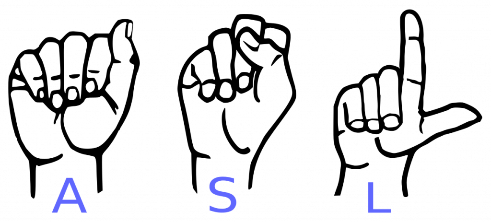

# Sign-Language-Recognition Project

  

  

## Introduction

A project that will help you translate american sign language to english alphabets. I have developed 2 interfaces :- detection in realtime and an application deployed using Flask where you can either upload an image of a sign language or you can click photos and then predict.

## Dataset Used

The novelity of the project is in it's dataset. The dataset used for training the project is a self developed one. I used mediapipe to create the same. 

**Idea behind developing the dataset** - Many of you must have heard of or some might have also drawn stick figures in their drawing classes. For the ones who are unaware of the term - *Stick figures are drawings of humans where we use lines to draw the human figure.* They are the most basic when it comes to drawing human structure. We draw humans in different poses using sticks. Mediapipe is the same. It detects our hand and draws it in terms of dots and lines which are easy to comprehend. According to me instead of using hands where there are lost of variations like color, size, space covered; it is much more effective if we train our model on hands drawn with dots and lines.

I did get a very positive output with this dataset which was quite unexpected. The dataset creation process was full of DIP(Digital Image Processing). The dataset will follow improvements in future.

 

👇👇 **Below are some pics of the dataset** 👇👇

 

## Limitations
- Detecting only right hand.
- Covering A-Z alphabets excluding J and Z.
- Unable to detect J and Z as they are moving signs in ASL.

## Future Scope
- Implement recognition for both hands.
- Increase scope from only alphabets to alphabets+numbers.
- Sentence creation in realtime.

## Demo Video

https://user-images.githubusercontent.com/54144759/176778683-2706bd2a-34da-4f95-989b-9527d11b5d8c.mp4

